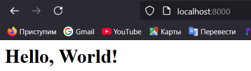

# Laborator: Utilizarea containerelor ca medii de execuție

## Scop
Această lucrare de laborator are ca scop familiarizarea cu comenzile de bază ale OS Debian/Ubuntu. De asemenea, aceasta va permite să vă familiarizați cu Docker și comenzile sale de bază.

## Sarcina
De creat un container Docker bazat pe imaginea oficială Ubuntu, care va conține un server web Apache. Se va crea o pagină web simplă care afișează textul "Hello, World!" și se va testa afișarea acesteia într-un browser.

## Descrierea executării lucrării de laborator

### Pregătire
Trebuie de instalat Docker.

### Crearea unui repository și inițializarea proiectului
Am creat un repository GitHub numit `containers03` și l-am clonat pe dispozitiv.

### Crearea și rularea containerului Docker

1. Am deschis terminalul în directorul `containers03` și am rulat următoarea comandă pentru a crea și porni un container Ubuntu cu portul 80 mapat la portul 8000:
   ```sh
   docker run -ti -p 8000:80 --name containers03 ubuntu bash
   ```
   
2. În fereastra nou deschisă, am actualizat lista de pachete:
   ```sh
   apt update
   ```
3. Am instalat serverul web Apache:
   ```sh
   apt install apache2 -y
   ```
4. Am pornit serviciul Apache:
   ```sh
   service apache2 start
   ```

### Testarea serverului web

1. Am deschis browserul `http://localhost:8000`.


2. Am verificat conținutul directorului web Apache:
   ```sh
   ls -l /var/www/html/
   ```
   
3. Am creat o pagină web simplă:
   ```sh
   echo '<h1>Hello, World!</h1>' > /var/www/html/index.html
   ```
4. Am dat refresh la pagina.

### Verificarea configurației Apache

1. Am accesat directorul configurației Apache:
   ```sh
   cd /etc/apache2/sites-enabled/
   ```
2. Am văzut conținutul fișierului de configurare implicită:
   ```sh
   cat 000-default.conf
   ```
    

### Închiderea și ștergerea containerului

1. Am ieșit din container:
   ```sh
   exit
   ```
2. Am arătat lista containerelor existente:
   ```sh
   docker ps -a
   ```
    
3. Am șters containerul creat:
   ```sh
   docker rm containers03
   ```

## Concluzii
Această lucrare de laborator ne-a permis să ne familiarizăm cu comenzile de bază ale Docker și cu administrarea unui server Apache într-un container. Am învățat cum să creăm un container, să rulăm un server web, să modificăm conținutul paginii principale și să gestionăm containerele utilizând comenzi Docker.
